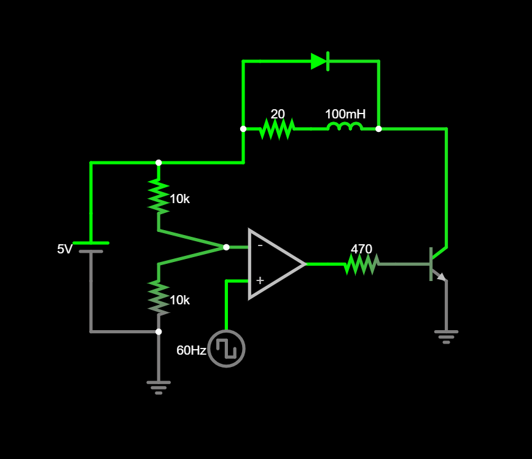

# Blind-Spot Glasses: IMAX Edition

A functional laser-powered haptic navigation wearable prototype designed to guide users to align their paths using a reference laser LED. 

## Project Overview

The wearable utilises a combination of IR sensor modules and mini disc vibrating motors to provide haptic feedback.

In each single-channel haptic feedback module, an op-amp comparator compares the sensor's voltage with the reference voltage provided by the voltage divider to ensure the motor is fully ON or OFF.
Moreover, the NPN transistors act like a switch to allow larger currents to flow into the motor.
Finally, flyback diodes are implemented to safely dissipate the energy from the motor's magnetic field.

The theoretical logic behind each single-channel haptic feedback module was generated using Falstad Circuit Generator, and verified using real-time simulation and oscilloscope data.

### Bill of Materials (BOM)

| Component | Quantity | Purpose |
| :--- | :---: | :--- |
| Infrared Sensor Module | 2 | Obstacle detection |
| LM358 Dual Op-Amp | 1 | Comparator logic |
| Mini Disc Vibrating Motor | 2 | Haptic feedback |
| 2N2222 NPN Transistor | 3 | Load switching |
| 1N4001 Diode | 3 | Flyback protection |
| 6mm Laser LED (650nm) | 1 | Path reference |
| Resistors (10k) | 4 | Used in voltage dividers|
| Resistors (470) | 3 | Base current limiting for transistors |
| Resistors (100) | 1 | Dummy load for power bank |

### Project Documentation: PRE-TEST

**NOTE:** This schematic is not fully representative of its practical counterpart, and is merely generated to verify the module's control logic.

### Project Documentation: BREADBOARD PROTOTYPE

### Thoughts on Final Design
